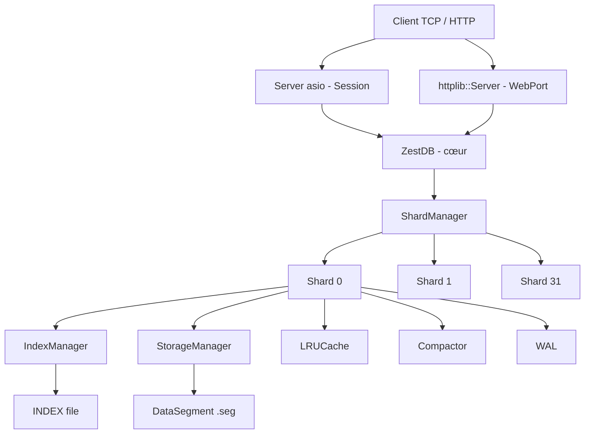

# RAPPORT D'ANALYSE — ZestDB

> Date d'analyse : 2026-07-15
> Version analysée : état courant du dépôt (`src/`, `config.yaml`, `Makefile`, `test*.py`)

---

## 1. Présentation générale

**ZestDB** est une base de données clé-valeur persistante, écrite en **C++20**, conçue autour d'une architecture **LSM-like** (Log-Structured Merge) avec sharding, cache LRU, WAL (Write-Ahead Log), compaction automatique et archivage ZIP.

### Objectifs du projet
- Stockage clé-valeur performant sur disque avec index en mémoire.
- Haute disponibilité via un serveur TCP (asio) et un serveur HTTP (httplib).
- Persistance durable grâce au WAL et flush périodique.
- Scalabilité horizontale interne via **32 shards** par défaut.
- Sécurité : authentification par token SHA-256, SSL/TLS optionnel, filtrage IP par regex.
- Archivage automatique de la base en archives ZIP.

### Langages & technologies
| Domaine | Technologie |
|---|---|
| Langage | C++20 (`-std=c++20`) |
| Réseau TCP | Asio (header-only) |
| HTTP | cpp-httplib (`lib/httplib.hpp`) |
| Sérialisation | nlohmann/json (`lib/json.hpp`) |
| YAML | fkyaml (`lib/node.hpp`) |
| Archivage | libzippp / libzip |
| Crypto | OpenSSL (SHA-256, SSL) |
| Tests | Python 3 (client socket) |
| Build | GNU Make + g++ |

---

## 2. Architecture globale



### Hiérarchie des composants

```
ZestDB
├── ShardManager (32 shards, ThreadPool)
│   └── Shard[]
│       ├── IndexManager   (index disque + hashmap mémoire)
│       ├── StorageManager  (gère les DataSegment)
│       │   └── DataSegment[] (.seg)
│       ├── LRUCache        (cache en mémoire)
│       ├── Compactor       (thread de compaction)
│       └── WAL             (Write-Ahead Log)
├── Server (asio TCP, port DBPort)
├── httplib::Server (HTTP, port WebPort)
├── flushThread (jthread)
└── saveThread (jthread - archivage)
```

---

## 3. Description détaillée des composants

### 3.1 ZestDB (cœur applicatif)
**Fichiers :** `src/ZestDB.hpp`, `src/ZestDB.cpp`, `src/main.cpp`

Point d'entrée et orchestrateur. Responsabilités :
- **Chargement de configuration** depuis `config.yaml` (`loadConfig`).
- **Hot-reload** de la configuration (`reloadConfig`) — les chemins et ports sont immuables à chaud.
- **Validation** des clés/valeurs (taille, format JSON optionnel, mode read-only).
- **Parsing de commandes** (`execCmd`) : `g`, `s`, `d`, `gb`, `sb`, `db`, `f`, `h`, etc.
- **Authentification** par token (`validateToken`) : `sha256(username + password)`.
- **WAL global** : `appendToWAL` délègue au shard concerné (sauf pendant le replay).
- **Replay WAL** au démarrage (`replayWAL`) : fusionne et trie par timestamp les WAL de tous les shards.
- **Archivage ZIP** (`createArchive`) via libzippp.
- **Threads de fond** : `flushThread` (flush périodique) et `saveThread` (archivage périodique), tous deux des `std::jthread` stoppables.

`main.cpp` démarre :
- Un thread de commande interactive (`cmd`).
- Un thread `io_context` asio.
- Le serveur HTTP httplib (`srv->listen`).
- Une population de test optionnelle (`./zestdb pop` → 1M clés).
- Gestion des signaux `SIGINT`/`SIGTERM`.

### 3.2 ShardManager
**Fichiers :** `src/ShardManager.hpp`, `src/ShardManager.cpp`

- Distribue les opérations vers le bon shard via `std::hash<std::string> % numShards`.
- Opérations **By** (`getBy`, `setBy`, `delBy`) exécutées **en parallèle** sur tous les shards via un `ThreadPool` (taille = `hardware_concurrency`).
- Compteur global atomique (`globalMatchCount`) pour respecter la `limit` inter-shards.
- `replayAllWAL` : fusionne tous les WAL, trie par timestamp, rejoue les commandes, puis flush + clear.

### 3.3 Shard
**Fichiers :** `src/Shard.hpp`, `src/Shard.cpp`

Unité de stockage indépendante. Chaque shard possède son propre :
- `INDEX` (fichier), `WAL` (fichier), dossier `seg/` (DataSegments), cache LRU, compactor.

Cycle de vie (`boot`) :
1. Création des dossiers/fichiers `INDEX` et `WAL` si absents.
2. Instanciation de `IndexManager`, `StorageManager`, `LRUCache`, `Compactor`.
3. `verifyIndexEntries` : vérifie la cohérence index ↔ segments.
4. Thread de remplissage du cache (`fillCache`) — détaché.
5. Thread compactor — détaché.

Verrouillage : `std::shared_mutex readMtx` (shared pour lectures, unique pour écritures). Mesure de latence pour le `PerfMonitoring`.

### 3.4 IndexManager
**Fichiers :** `src/IndexManager.hpp`, `src/IndexManager.cpp`

- Index **persistant** : fichier binaire d'enregistrements `IndexEntry` (clé fixe 256 octets, segmentId, offset, size, isTombstone).
- Index **en mémoire** : `unordered_map<string, streamoff>` (`memoryTree`) + liste des offsets de tombstones (`tombstoneOffsets`).
- **Réutilisation des slots tombstone** lors de l'insertion (espace récupéré).
- **Compaction** : copie de sécurité (`INDEX.tmp`), réécriture compacte sans tombstones, mise à jour de l'arbre mémoire.
- Récupération au démarrage : si `INDEX.tmp` existe, il remplace `INDEX` (sécurité anti-corrruption).

### 3.5 StorageManager & DataSegment
**Fichiers :** `src/StorageManager.*`, `src/DataSegment.*`

- `StorageManager` gère une collection de `DataSegment` (fichiers `.seg`).
- Append-only : écrit dans le segment courant ; crée un nouveau segment quand le courant est plein (`SegSize`).
- `DataSegment` : fichier binaire append-only, offset courant atomique, verrou par segment.
- `removeUnusedSegments` : supprime les segments non référencés après compaction.
- Flush conditionnel via flag `canFlush`.

### 3.6 LRUCache
**Fichiers :** `src/LRUCache.hpp`, `src/LRUCache.cpp`

- Cache **Least Recently Used** classique : `list` (ordre) + `unordered_map` (accès O(1)).
- Capacité configurable (`CacheSize`), éviction du moins récemment utilisé.
- Verrou `std::mutex`.
- Rempli au démarrage du shard avec les premières entrées de l'index.

### 3.7 WAL (Write-Ahead Log)
**Fichiers :** `src/WAL.hpp`, `src/WAL.cpp`

- Format binaire : `[size][cmd][timestamp_ms]['\n']` par entrée.
- `append` écrit + flush immédiat (durabilité).
- `getCmds` lit et trie par timestamp.
- `clear` tronque le fichier (appelé après flush réussi).
- Protection : taille max 1 000 000 pour éviter corruption.

### 3.8 Compactor
**Fichiers :** `src/Compactor.hpp`, `src/Compactor.cpp`

- Thread tournant en boucle, dormant `CompactingInterval` secondes.
- Compacte l'index (supprime tombstones), puis supprime les segments inutilisés.
- Arrêt propre via `stopFlag` atomique.

### 3.9 Server (TCP asio)
**Fichiers :** `src/Server.hpp`, `src/Server.cpp`

- Serveur TCP asio avec support SSL optionnel (`std::variant<tcp::socket, ssl::stream>`).
- **Protocole binaire** : `[4 octets taille payload][payload]`, payload = batch de `[4 octets taille cmd][cmd]`.
- **Authentification** : première commande doit être `Authorization: <user>.<token>`.
- **Filtrage IP** via regex `NetworkValidation`.
- Réponses JSON séparées par `\r\n\r\n` dans un batch.

### 3.10 PerfMonitoring & Logger
**Fichiers :** `src/PerfMonitoring.*`, `src/Logger.*`

- `PerfMonitoring` : statistiques par opération (get/set/del et leurs variantes By) — nombre de requêtes, cache misses, latence moyenne. Exposé via le endpoint HTTP `/`.
- `Logger` : 5 niveaux (INFO, DEBUG, WARNING, ERROR, CRITICAL) avec codes couleur. Mode debug activable.

### 3.11 ThreadPool
**Fichiers :** `src/ThreadPool.hpp`, `src/ThreadPool.cpp`

- Pool de threads générique avec file de tâches, `std::future`, et `waitAll()`.
- Utilisé par `ShardManager` pour paralléliser les opérations `*By`.

---

## 4. Configuration

Fichier `config.yaml` (parsé via fkyaml) :

| Paramètre | Défaut config | Description |
|---|---|---|
| `DbPath` | `/home/test/DB` | Dossier racine de la base |
| `SegSize` | 64 Mo | Taille max d'un segment de données |
| `MaxKeySize` | 255 | Taille max d'une clé (limite interne 256) |
| `MaxValueSize` | 100 000 | Taille max d'une valeur |
| `CacheSize` | 50 000 | Nombre max d'entrées dans le cache LRU |
| `CompactingInterval` | 300 s | Intervalle entre compactions |
| `FlushInterval` | 500 s | Intervalle entre flush disque |
| `DBPort` | 7321 | Port TCP (asio) |
| `WebPort` | 1237 | Port HTTP (httplib) |
| `NetworkValidation` | `.*` | Regex de filtrage IP |
| `isDebug` | true | Logs détaillés |
| `jsonOnly` | false | Force les valeurs au format JSON |
| `readOnly` | false | Mode lecture seule |
| `useSSL` | false | Active SSL/TLS |
| `SSLCertPath` / `SSLKeyPath` | — | Chemins certificat/clé |
| `ArchiveStoragePath` | `/home/test/DBArchives` | Dossier des archives |
| `ArchiveCreationDelay` | 10 s | Intervalle entre archivages |
| `AutoArchiveSaving` | true | Active l'archivage automatique |
| `users` | bob/bob | Liste des utilisateurs |

**Validations au chargement** :
- `MaxValueSize < SegSize` (sinon erreur fatale).
- `MaxKeySize` clampé à `MAX_KEY_SIZE` (256).
- `DBPort != WebPort` et ports ≥ 0.
- SSL nécessite cert + key.

---

## 5. Protocole & API

### 5.1 Commandes texte (CLI et TCP)

| Commande | Alias | Description |
|---|---|---|
| `get <key>` | `g` | Récupère une valeur |
| `set <key> <value>` | `s` | Définit une valeur |
| `del <key>` | `d` | Supprime (tombstone) |
| `getby <mode> <pattern> [lim <n>]` | `gb` | Recherche par pattern |
| `setby <mode> <pattern> <value> [lim <n>]` | `sb` | Modification par pattern |
| `delby <mode> <pattern> [lim <n>]` | `db` | Suppression par pattern |
| `flush` | `f` | Force le flush disque |
| `help` | `h` | Aide |
| `quit` | `q` | Quitte (CLI) |

**Modes de pattern** : `re` (regex), `sw` (startswith), `ct` (contains), `ew` (endswith).

### 5.2 Format de réponse (JSON)

```json
{
  "code": 0,
  "response": "<valeur ou message>",
  "affectedRows": 1
}
```

`code` : `0` = SUCCESS, `1` = ERROR (enum `ResultType::Code`).

### 5.3 Endpoint HTTP

- `GET /` : renvoie les statistiques de performance par shard (JSON).

### 5.4 Authentification

- Token = `sha256(username + password)`.
- En-tête TCP : `Authorization: <username>.<token>`.
- Échec → fermeture de la connexion.

---

## 6. Tests

**Fichiers :** `test.py`, `test2.py`, `test3.py`

- Client Python (`ZestDBClient` / `ZestDBApi`) avec support SSL, batching, et parsing de réponses.
- `test.py` : client interactif REPL avec commandes séparées par `;`.
- API orientée objet : `ZestResponse` avec `is_success()` (code == 4 — ⚠️ incohérence, voir §8).

---

## 7. Build & dépendances

### Makefile
- Compilateur : `g++` avec flags stricts (`-Wall -Wextra -Wpedantic -Werror -Wsign-conversion -Wshadow`).
- **Mode DEBUG** (`make DEBUG=1`) : AddressSanitizer + UBSan, `-O0 -g`.
- **Mode release** : `-O3`.
- Cibles : `all`, `clean`, `run`.

### Dépendances externes (link)
`-lcrypto -lssl -lzippp_static -lzip -lz -lbz2 -llzma -lzstd`

### Bibliothèques vendorisées (`src/lib/`)
- `httplib.hpp` (cpp-httplib)
- `json.hpp` (nlohmann/json)
- `node.hpp` (fkyaml)

---

## 8. Points forts

1. **Architecture LSM-like cohérente** : append-only + index en mémoire + tombstones + compaction.
2. **Sharding transparent** (32 shards) avec hashage automatique et parallélisme des requêtes `*By`.
3. **Durabilité** : WAL par shard avec flush immédiat + replay au démarrage trié par timestamp.
4. **Récupération anti-corrumption** : `INDEX.tmp` restauré au démarrage si présent.
5. **Cache LRU** pré-rempli au démarrage pour réduire les cache misses.
6. **C++20 moderne** : `std::jthread`, `stop_token`, `std::format`, `std::shared_mutex`, `std::variant`.
7. **Sécurité** : authentification token, SSL/TLS, filtrage IP.
8. **Observabilité** : `PerfMonitoring` exposé en HTTP, logger coloré multi-niveaux.
9. **Hot-reload** de configuration (paramètres non structurels).
10. **Archivage automatique** ZIP de la base complète.

---

## 9. Points faibles & problèmes détectés

### 9.1 Bugs / incohérences

| # | Sévérité | Localisation | Problème |
|---|---|---|---|
| 1 | **Haute** | `test.py` `ZestResponse.is_success` | Vérifie `code == 4` mais l'enum C++ vaut `SUCCESS = 0`, `ERROR = 1`. Le client ne reconnaîtra jamais un succès. |
| 2 | **Haute** | `test.py` `_receive_responses` | Le buffer est réinitialisé (`self._buffer = ""`) après split, ce qui peut perdre des données si plusieurs batches se chevauchent. |
| 3 | **Moyenne** | `StorageManager::boot` | `std::stoi(entry.path().filename())` parse le nom **sans extension** or les fichiers sont `1.seg` → `std::stoi("1.seg")` lève une exception. |
| 4 | **Moyenne** | `IndexManager::search` | Retourne `{ "", -1, ... }` mais `IndexEntry.key` est un `char[256]` — l'initialisation avec `""` est ambiguë/non portable. |
| 5 | **Moyenne** | `Shard::boot` | `compactorThread` est `detach()` et non un `jthread` stoppable — ne respecte pas le TODO.txt (compactor en jthread stoppable). |
| 6 | **Basse** | `ZestDB.cpp` `reloadConfig` | Faute de frappe : `"Cannot change the ports settongs..."`. |
| 7 | **Basse** | `WAL::append` | `'\n'` ajouté mais `getCmds` utilise `peek()` — fragile si corruption partielle. |

### 9.2 Risques de concurrence

- **`Shard::boot`** : `cacheThread` et `compactorThread` sont détachés ; `fillCache` et le compactor peuvent accéder à l'index simultanément sans coordination explicite (le compactor prend le `unique_lock` du `shared_mutex` de l'IndexManager, mais `fillCache` utilise `getAll` en lecture — OK via `shared_lock`, mais à vérifier).
- **`ShardManager::getBy`** : `valid.globalMatchCount` est un pointeur sur une variable locale de pile — sûr car `futures` sont attendus avant sortie, mais fragile si modification future.
- **`Settings` partagé** : `Shard` stocke une **copie** de `Settings` (`Settings settings;`), modifiée dans `boot` (`DbPath`, `IndexPath`, `WalPath`). Le `reloadSettings` met à jour la copie mais les chemins ne sont pas rechargés (cohérent avec l'interdiction de changer les chemins à chaud).

### 9.3 Manques

1. **README.md vide** — aucune documentation d'utilisation/installation.
2. **Aucun test automatisé C++** (pas de framework type GoogleTest/Catch2).
3. **Pas de CI/CD** ni de pipeline de build.
4. **`fsync` commenté** dans `IndexManager::flush`, `DataSegment::flush`, `WAL::append` — la durabilité réelle sur crash OS n'est pas garantie (seul le `flush` du buffer C++ est fait).
5. **TODO.txt non traité** :
   - Archivage basé sur la date de la dernière archive (timer 24h - temps écoulé).
   - Compactor de Shard en `jthread` stoppable par `settings.isRunning`.

### 9.4 Qualité du code

- **Très bonne** dans l'ensemble : RAII, smart pointers, `std::unique_ptr`, `std::jthread`, verrous adaptés.
- **Logging verbeux** : beaucoup de logs DEBUG par opération — peut saturer en production.
- **Messages d'erreur** centralisés dans `Settings.hpp` (`Messages`) — bonne pratique.
- **Pas de namespace** global — tout est en classes, acceptable pour un projet de cette taille.

---

## 10. Recommandations

### Court terme (corrections)
1. **Corriger `test.py`** : `is_success` doit vérifier `code == 0` (ou mapper l'enum correctement).
2. **Corriger `StorageManager::boot`** : retirer l'extension avant `stoi` (`filename().stem()`).
3. **Corriger `IndexManager::search`** : retourner un `IndexEntry` correctement initialisé (`memset` + `segmentId = -1`).
4. **Corriger la faute** `"settongs"` → `"settings"`.

### Moyen terme
5. **Activer `fsync`** (ou `std::filesystem::resize_file` + sync) pour une vraie durabilité.
6. **Transformer le compactor de Shard en `std::jthread`** stoppable (TODO.txt).
7. **Implémenter l'archivage intelligent** basé sur la date de la dernière archive (TODO.txt).
8. **Ajouter des tests C++** automatisés (Catch2/GoogleTest).
9. **Rédiger le README.md** : installation, dépendances, utilisation, protocole.

### Long terme
10. **Réplication** multi-nœuds pour la haute disponibilité.
11. **Transactions** multi-clés (actuellement chaque opération est atomique par clé, pas de batch transactionnel).
12. **Compression** des segments de données (zstd est déjà linké).
13. **Index secondaire** pour requêtes par valeur.
14. **Métriques Prometheus** au-delà du simple endpoint `/`.

---

## 11. Synthèse

ZestDB est un projet **personnel de bonne facture** démontrant une solide compréhension des architectures de bases de données (LSM, sharding, WAL, compaction, cache). Le code C++20 est moderne, structuré et utilise correctement les outils de concurrence. Quelques bugs fonctionnels (client Python, parsing de nom de segment) et manques (fsync, tests, doc) sont à adresser pour passer en production, mais l'architecture est saine et extensible.

**Score global estimé : 7.5/10** — solide architecturalement, à fiabiliser sur la durabilité et les tests.

---

*Généré automatiquement par analyse statique du code source.*
